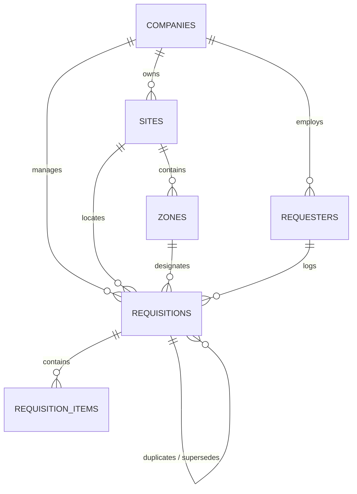

# ADR-0001: Supabase Database Schema, State Machine & Shared Data Contracts

## Status
Accepted

## Context
Supply Conduit connects field sites across Southern Africa (farms, packhouses, civil construction job sites, industrial logistics yards) to backoffice procurement teams. Requisitions originate from WhatsApp voice notes and text messages. To guarantee high integrity, deterministic progression, multi-tenant isolation, and automated duplication checks, the database architecture requires formal mathematical and relational definitions before implementation.

---

## 1. Multi-Tenant Relational Schema Architecture

The relational schema is scoped by `companies` (the primary tenant). All child entities belong either directly or hierarchically to a company.



### Table Specifications

#### 1. `companies`
- `id`: `UUID PRIMARY KEY DEFAULT gen_random_uuid()`
- `name`: `TEXT NOT NULL` (e.g., "Ceres Fruit Growers", "WBHO Civils Section 8")
- `slug`: `TEXT NOT NULL UNIQUE`
- `currency`: `VARCHAR(3) NOT NULL DEFAULT 'ZAR'`
- `timezone`: `TEXT NOT NULL DEFAULT 'Africa/Johannesburg'`
- `settings`: `JSONB NOT NULL DEFAULT '{"duplicate_window_days": 7, "require_zone": false}'::jsonb`
- `created_at`: `TIMESTAMPTZ NOT NULL DEFAULT timezone('utc'::text, now())`
- `updated_at`: `TIMESTAMPTZ NOT NULL DEFAULT timezone('utc'::text, now())`

#### 2. `sites` (Operational Facilities)
- `id`: `UUID PRIMARY KEY DEFAULT gen_random_uuid()`
- `company_id`: `UUID NOT NULL REFERENCES companies(id) ON DELETE CASCADE`
- `name`: `TEXT NOT NULL` (e.g., "Packhouse 4", "N2 Highway Bridge Contract")
- `code`: `VARCHAR(20) NOT NULL` (e.g., "CERES-P4", "CIV-N2-08")
- `location_description`: `TEXT`
- `is_active`: `BOOLEAN NOT NULL DEFAULT true`
- `created_at`: `TIMESTAMPTZ NOT NULL DEFAULT timezone('utc'::text, now())`
- *Constraints*: `UNIQUE(company_id, code)`

#### 3. `zones` (Operational Sub-Quadrants)
- `id`: `UUID PRIMARY KEY DEFAULT gen_random_uuid()`
- `site_id`: `UUID NOT NULL REFERENCES sites(id) ON DELETE CASCADE`
- `name`: `TEXT NOT NULL` (e.g., "Chamber B", "Pump Station 3", "Culvert Pouring North")
- `code`: `VARCHAR(20)` (e.g., "CS-B", "PUMP-3")
- `is_active`: `BOOLEAN NOT NULL DEFAULT true`
- `created_at`: `TIMESTAMPTZ NOT NULL DEFAULT timezone('utc'::text, now())`
- *Constraints*: `UNIQUE(site_id, name)`

#### 4. `requesters` (Authorized Field Workers)
- `id`: `UUID PRIMARY KEY DEFAULT gen_random_uuid()`
- `company_id`: `UUID NOT NULL REFERENCES companies(id) ON DELETE CASCADE`
- `phone_number`: `VARCHAR(20) NOT NULL` (E.164 formatted, e.g. `+27821234567`)
- `name`: `TEXT NOT NULL` (e.g., "Braam van der Merwe")
- `role_title`: `TEXT` (e.g., "Site Agent", "Maintenance Lead")
- `default_site_id`: `UUID REFERENCES sites(id) ON DELETE SET NULL`
- `is_active`: `BOOLEAN NOT NULL DEFAULT true`
- `created_at`: `TIMESTAMPTZ NOT NULL DEFAULT timezone('utc'::text, now())`
- *Constraints*: `UNIQUE(company_id, phone_number)`

#### 5. `requisitions` (Master Requisition Header)
- `id`: `UUID PRIMARY KEY DEFAULT gen_random_uuid()`
- `company_id`: `UUID NOT NULL REFERENCES companies(id) ON DELETE CASCADE`
- `reference_code`: `VARCHAR(32) NOT NULL UNIQUE` (Internal requisition ref e.g. `REQ-2609-1001`)
- `po_number`: `VARCHAR(32) UNIQUE` (Official PO code e.g. `PO-10001`, assigned upon placement)
- `site_id`: `UUID NOT NULL REFERENCES sites(id) ON DELETE RESTRICT`
- `zone_id`: `UUID REFERENCES zones(id) ON DELETE SET NULL`
- `requester_id`: `UUID NOT NULL REFERENCES requesters(id) ON DELETE RESTRICT`
- `status`: `requisition_status NOT NULL DEFAULT 'LOGGED'`
- `urgency`: `urgency_level NOT NULL DEFAULT 'ROUTINE'`
- `raw_message_text`: `TEXT` (Original WhatsApp text or Whisper audio transcript)
- `audio_url`: `TEXT` (Supabase Storage URI for voice note)
- `media_urls`: `TEXT[] NOT NULL DEFAULT '{}'`
- `whatsapp_message_id`: `VARCHAR(128) UNIQUE` (Idempotency key from Meta API)
- `is_duplicate_suspect`: `BOOLEAN NOT NULL DEFAULT false`
- `duplicate_of_id`: `UUID REFERENCES requisitions(id) ON DELETE SET NULL`
- `assigned_buyer_id`: `UUID REFERENCES auth.users(id) ON DELETE SET NULL`
- `supplier_name`: `TEXT`
- `total_estimated_zar`: `NUMERIC(12, 2) DEFAULT 0.00`
- `notes`: `TEXT`
- `created_at`: `TIMESTAMPTZ NOT NULL DEFAULT timezone('utc'::text, now())`
- `updated_at`: `TIMESTAMPTZ NOT NULL DEFAULT timezone('utc'::text, now())`

#### 6. `requisition_items` (Extracted Line Items)
- `id`: `UUID PRIMARY KEY DEFAULT gen_random_uuid()`
- `requisition_id`: `UUID NOT NULL REFERENCES requisitions(id) ON DELETE CASCADE`
- `item_description`: `TEXT NOT NULL`
- `normalized_tokens`: `TEXT` (Search-optimized, lowercased, punctuation-stripped tokens)
- `quantity`: `NUMERIC(10, 2) NOT NULL DEFAULT 1.0`
- `unit_of_measure`: `VARCHAR(30) NOT NULL DEFAULT 'units'`
- `part_number`: `VARCHAR(100)`
- `notes`: `TEXT`
- `pastel_item_code`: `VARCHAR(50)`
- `unit_price_zar`: `NUMERIC(12, 2)`
- `created_at`: `TIMESTAMPTZ NOT NULL DEFAULT timezone('utc'::text, now())`

---

## 2. Requisition Status State Machine

The status transitions represent a linear procurement lifecycle with a terminal cancellation route:

```mermaid
stateDiagram-v2
    [*] --> LOGGED : Ingestion via WhatsApp / Audio / Text
    LOGGED --> PENDING_QUOTE : Buyer acknowledges & requests pricing
    PENDING_QUOTE --> PO_PLACED : Quote approved; PO generated
    PO_PLACED --> DELIVERED_TO_SITE : Goods arrived & inspected on site
    DELIVERED_TO_SITE --> CLOSED : Invoice verified & matched in Pastel
    
    LOGGED --> CANCELLED : Rejected / Duplicate / Invalid
    PENDING_QUOTE --> CANCELLED : Cancelled by requester or site agent
    PO_PLACED --> CANCELLED : Supplier cannot fulfill
    CANCELLED --> [*]
    CLOSED --> [*]
```



### Transition Invariants
1. `LOGGED -> PENDING_QUOTE`: Permitted for authenticated buyers or automated dispatch.
2. `PENDING_QUOTE -> PO_PLACED`: Requires `po_number` to be populated via the sequence generator.
3. `PO_PLACED -> DELIVERED_TO_SITE`: Confirms site delivery. Triggers notification ping to requester.
4. `DELIVERED_TO_SITE -> CLOSED`: Reconciliation complete; requisition items locked from further edit.
5. Any state (except `CLOSED`) `-> CANCELLED`: Requisition is deactivated; sets cancellation reason in notes.

---

## 3. Human-Readable PO Generation Algorithm

Purchase Order numbers must be concise, monotonically increasing, sequential per company, and easily communicated over UHF two-way radio or phone.

### Specification
- Format: `PO-{10000 + sequence_val}` (e.g. `PO-10001`, `PO-10002`).
- Storage: Generated only when requisition moves to status `PO_PLACED`.
- Database Implementation Pattern:
```sql
CREATE SEQUENCE IF NOT EXISTS po_number_seq START 10001;

CREATE OR REPLACE FUNCTION assign_po_number()
RETURNS TRIGGER AS $$
BEGIN
    IF NEW.status = 'PO_PLACED' AND (NEW.po_number IS NULL OR NEW.po_number = '') THEN
        NEW.po_number := 'PO-' || nextval('po_number_seq')::text;
    END IF;
    RETURN NEW;
END;
$$ LANGUAGE plpgsql;
```

---

## 4. Rolling 7-Day Duplicate Order Detection Algorithm

Field personnel frequently re-send requests when under stress or when shifts overlap (e.g. foreman A asks for gate valves at 07:00; lead mechanic asks for the same valves at 11:00).

### Query Logic & Fuzzy Token Match
1. Window: `created_at >= NOW() - INTERVAL '7 days'`
2. Site Filter: `site_id = p_site_id`
3. Status Filter: Excludes `CANCELLED` orders.
4. Tokenization & Search:
   - Input line descriptions are normalized (lowercased, whitespace-trimmed, stop words like "need", "urgent", "please" removed).
   - PostgreSQL `pg_trgm` extension or full-text / ILIKE containment is run against prior `requisition_items`.
5. Database RPC Specification:
```sql
CREATE OR REPLACE FUNCTION check_7day_duplicates(
    p_site_id UUID,
    p_search_tokens TEXT[],
    p_exclude_requisition_id UUID DEFAULT NULL
)
RETURNS TABLE (
    suspect_requisition_id UUID,
    reference_code TEXT,
    matched_item TEXT,
    created_at TIMESTAMPTZ,
    status requisition_status
) AS $$
BEGIN
    RETURN QUERY
    SELECT 
        r.id,
        r.reference_code,
        ri.item_description,
        r.created_at,
        r.status
    FROM requisitions r
    JOIN requisition_items ri ON ri.requisition_id = r.id
    WHERE r.site_id = p_site_id
      AND r.created_at >= (NOW() - INTERVAL '7 days')
      AND r.status != 'CANCELLED'
      AND (p_exclude_requisition_id IS NULL OR r.id != p_exclude_requisition_id)
      AND EXISTS (
          SELECT 1 FROM unnest(p_search_tokens) token
          WHERE ri.item_description ILIKE '%' || token || '%'
      )
    ORDER BY r.created_at DESC
    LIMIT 5;
END;
$$ LANGUAGE plpgsql STABLE SECURITY DEFINER;
```

---

## 5. Security & Row-Level Security (RLS) Boundaries

All client traffic is subject to PostgreSQL Row-Level Security. Edge ingestion routines run under the `service_role` and bypass RLS cleanly.

### Boundary Model
1. **Office Users (Browser Client)**:
   - Authenticated via Supabase Auth (`auth.uid()`).
   - Tenant boundary determined via JWT claim: `(auth.jwt() -> 'app_metadata' ->> 'company_id')::uuid`.
   - Read/Write permitted on records where `company_id = current_user_company_id()`.
2. **Edge Functions / Ingestion Workers**:
   - Authenticated via `SUPABASE_SERVICE_ROLE_KEY`.
   - Bypasses RLS to insert raw WhatsApp payloads, auto-register unknown requesters, and query cross-tenant stats if required.
3. **Public / Unauthenticated**:
   - Zero access (`RESTRICTIVE` default deny on all tables).

---

## 6. Shared Data Contracts (JSON / TypeScript)

### Inbound WhatsApp Webhook Payload Contract
```typescript
export interface InboundWhatsAppWebhookPayload {
  object: "whatsapp_business_account";
  entry: Array<{
    id: string;
    changes: Array<{
      value: {
        messaging_product: "whatsapp";
        metadata: {
          display_phone_number: string;
          phone_number_id: string;
        };
        contacts?: Array<{
          profile: { name: string };
          wa_id: string; // e.g. "27821234567"
        }>;
        messages?: Array<{
          from: string;
          id: string; // "wamid.HBgL..."
          timestamp: string;
          type: "text" | "audio" | "image";
          text?: { body: string };
          audio?: { id: string; mime_type: string };
          image?: { id: string; mime_type: string; caption?: string };
        }>;
      };
      field: "messages";
    }>;
  }>;
}
```

### Structured LLM Extraction Contract
```typescript
export type UrgencyLevel = "ROUTINE" | "URGENT" | "CRITICAL_BREAKDOWN";

export interface ExtractedLineItemContract {
  item_description: string;
  quantity: number;
  unit_of_measure: string; // "units" | "meters" | "kg" | "bags" | "rolls" | "boxes" | "litres"
  part_number?: string | null;
  notes?: string | null;
}

export interface StructuredRequisitionExtraction {
  items: ExtractedLineItemContract[];
  urgency: UrgencyLevel;
  urgency_reason?: string | null;
  site_hint?: string | null;
  zone_hint?: string | null;
  confidence_score: number; // 0.0 to 1.0
  clarification_needed?: string | null;
}
```

### Frontend Requisition State Contract
```typescript
export interface RequisitionCardState {
  id: string;
  reference_code: string;
  po_number?: string | null;
  site_name: string;
  site_code: string;
  zone_name?: string | null;
  requester_name: string;
  requester_phone: string;
  status: "LOGGED" | "PENDING_QUOTE" | "PO_PLACED" | "DELIVERED_TO_SITE" | "CLOSED" | "CANCELLED";
  urgency: UrgencyLevel;
  is_duplicate_suspect: boolean;
  duplicate_of_ref?: string | null;
  raw_message_text?: string | null;
  audio_url?: string | null;
  items: Array<{
    id: string;
    item_description: string;
    quantity: number;
    unit_of_measure: string;
    part_number?: string | null;
    unit_price_zar?: number | null;
    line_total_zar?: number | null;
    pastel_item_code?: string | null;
  }>;
  total_estimated_zar: number;
  created_at: string;
}
```
