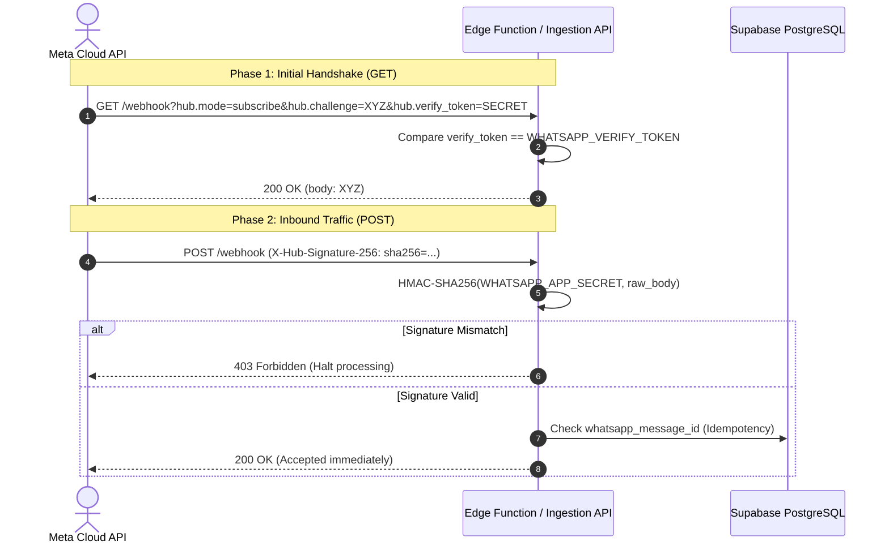
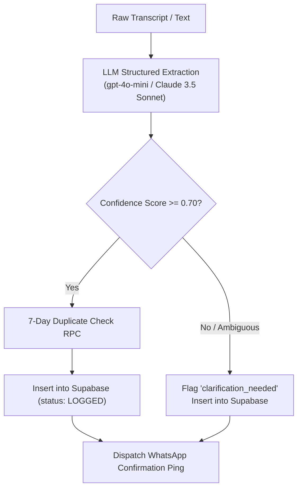

# ADR-0002: WhatsApp Ingestion, Voice Transcription & Structured AI Pipeline

## Status
Accepted

## Context
Site foremen, packhouse managers, and civil mechanics in Southern Africa do not log into web dashboards when a pump seal fails or when cement runs short. They send rapid voice notes or informal text messages via WhatsApp while on-site. The webhook engine must verify incoming payloads, enforce idempotency against network retries, transcribe noisy voice notes (handling Afrikaans/English technical jargon), extract structured items using LLMs, and reply immediately with an automated confirmation ping.

---

## 1. Webhook Handshake & Cryptographic Validation

Meta Cloud API requires two distinct webhook mechanisms:



### Handshake Verification (HTTP GET)
- Parameters: `hub.mode`, `hub.verify_token`, `hub.challenge`.
- Validation: If `hub.mode === 'subscribe'` and `hub.verify_token === WHATSAPP_VERIFY_TOKEN`, return `hub.challenge` as plain text with status 200. Otherwise return status 403.

### Cryptographic Payload Verification (HTTP POST)
- Header: `X-Hub-Signature-256`.
- Value: `sha256=<hex_digest>`.
- Algorithm: HMAC-SHA256 computed over raw binary payload with `WHATSAPP_APP_SECRET`.
- Rule: If signature is missing or verification fails, abort immediately with 403 Forbidden before triggering LLM or transcription services.

---

## 2. Idempotency & Network Retry Strategy

WhatsApp's webhook delivery guarantees at-least-once delivery. If the server takes longer than 3–5 seconds to return 200 OK, Meta will retry the request with the identical message ID.

### Invariant Rules
1. **Immediate Acknowledgment**: Return HTTP 200 OK as soon as the message signature is verified and the background task is queued.
2. **Deduplication Key**: Use `whatsapp_message_id` (e.g. `wamid.HBgLMjc4...`).
3. **Database Check**:
   ```sql
   -- Prevent race condition on duplicate webhook delivery
   INSERT INTO requisitions (company_id, whatsapp_message_id, ...)
   VALUES (...)
   ON CONFLICT (whatsapp_message_id) DO NOTHING;
   ```
4. If a conflict occurs, drop subsequent processing silently.

---

## 3. Audio Offloading & Voice Transcription (Whisper Pipeline)

For messages of type `audio`:
1. **Metadata Query**: Fetch media URL from Meta Graph API (`GET https://graph.facebook.com/v19.0/{audio_id}`).
2. **Binary Download**: Download the `.ogg` (Opus) audio stream using bearer token.
3. **Storage Persistence**: Upload the raw audio file to Supabase Storage bucket `requisition-audio/{message_id}.ogg`.
4. **Whisper Transcription**:
   - Engine: OpenAI Whisper API (`whisper-1`) or self-hosted Whisper.
   - Temperature: `0.0` (deterministic parsing).
   - Domain Vocabulary Prompting: Provide domain prompt to Whisper to anchor technical South African terminology:
     > *"Prompt: Requisition for South African job site: 50mm gate valve, cement bags, binding wire, submersible pump, HDPE pipe, packhouse conveyor belt, bakkie spares, rebar, Ceres, Western Cape."*

---

## 4. Structured LLM Parsing & Industrial Vocabulary Engine

### Prompt Engineering Architecture
The LLM parser transforms messy transcripts into typed line items.



### South African Few-Shot Industrial Dictionary
The system prompt must inject regional operational vocabulary:
- **Civil & Building**: "pocket of cement" / "sakke sement" (50kg bags), "binding wire" / "draad", "rebar" / "Y12 / Y16 steel", "crushed stone", "G5 gravel".
- **Pumps & Irrigation**: "gate valve" / "klapklep", "polypipe", "HDPE 63mm PN10", "mechanical shaft seal", "ferrules", "booster pump".
- **Warehouse & Agriculture**: "picking bins", "pallet wrap", "carton sealer", "PTFE thread tape", "forklift shear pin", "conveyor cleat".

### Extraction System Prompt Strategy
```text
You are an expert procurement and supply-chain parsing assistant for Southern African operational job sites, civil works, and agricultural packhouses.
Parse the user's message into structured JSON matching the provided schema.

Rules:
1. Normalize item descriptions (e.g. '3 of those 50 mil brass valves' -> 'Brass Gate Valve 50mm PN16').
2. Normalize unit of measure: 'units', 'meters', 'kg', 'bags', 'rolls', 'boxes', 'litres'.
3. Detect Urgency:
   - CRITICAL_BREAKDOWN: Harvest line stopped, pump failed, main generator off, work halted.
   - URGENT: Needed within 24 hours to avoid stoppage.
   - ROUTINE: General replenishment.
4. Calculate confidence_score between 0.0 and 1.0 based on clarity of items, quantities, and descriptions.
```

---

## 5. Automated Field Confirmation Ping Specification

Once the requisition is committed to Supabase, an outbound WhatsApp message is immediately dispatched to the requester's phone number.

### Confirmation Message Template
```text
✅ *Requisition Received: {reference_code}*

*Priority:* {urgency_label}
*Site:* {site_name} {zone_name_if_present}

*Items Captured:*
• {qty} {unit} - {item_description}
• {qty} {unit} - {item_description}

Status: *Logged in Office Backoffice*
Our procurement team has received your order and is sourcing supplier quotes. You will receive updates as the order progresses.
```

### Ambiguous / Low Confidence Fallback Template (confidence_score < 0.70)
```text
⚠️ *Requisition Logged (Clarification Needed): {reference_code}*

We received your voice note/message, but our system needs clarification:
_{clarification_needed}_

Our backoffice team will review and contact you shortly if additional part numbers or site details are needed.
```
