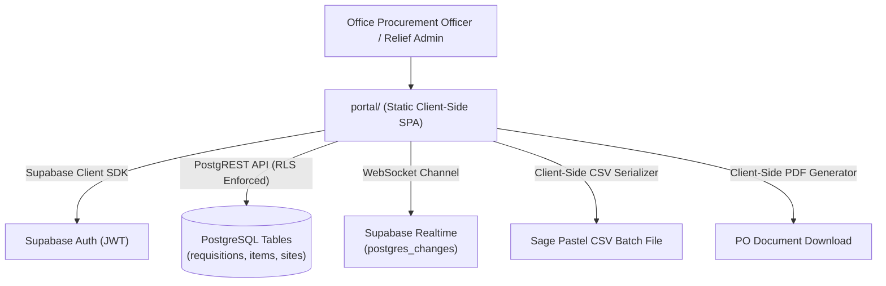

# ADR-0004: Office Portal Lightweight Frontend Architecture & Execution Plan

## Status
Accepted

## Target Implementer
**AGY** (Lead Architect & Frontend Builder)

## Context
Backoffice procurement staff require a fast, clean, zero-friction web portal to triage requisitions originating from job sites, inspect transcribed audio notes, approve POs, and export batches directly into Sage Pastel. To keep infrastructure ultra-lean and portable, the portal (`portal/`) is architected as a lightweight, static web client connecting directly to Supabase via `@supabase/supabase-js`.

---

## 1. Portal Architecture Overview



### Architectural Principles
1. **Lightweight & Static**: Can be hosted on any static edge CDN (Cloudflare Pages, Vercel, Supabase Storage hosting, or local nginx).
2. **Direct-to-Supabase**: No custom middle-tier Node/Express server required for basic CRUD; queries use `@supabase/supabase-js` bound by Row-Level Security.
3. **Optimistic UI Updates**: State changes (moving cards across Kanban columns) reflect immediately on the UI while updating the database in the background.

---

## 2. Real-Time Kanban Pipeline Board

### Kanban Columns
1. `LOGGED` (Awaiting review)
2. `PENDING_QUOTE` (Supplier RFQ in progress)
3. `PO_PLACED` (PO generated and confirmed)
4. `DELIVERED_TO_SITE` (Goods on site)
5. `CLOSED` (Reconciled with accounting)

### Realtime Subscription Model (`postgres_changes`)
To ensure multiple buyers or relief staff collaborate without stale data:
```typescript
const channel = supabase
  .channel("requisitions-live-sync")
  .on(
    "postgres_changes",
    {
      event: "*",
      schema: "public",
      table: "requisitions",
    },
    (payload) => {
      handleRealtimeRequisitionChange(payload);
    }
  )
  .subscribe();
```
- On `INSERT`: Prepend new card to the `LOGGED` column with entry animation and sound alert if priority is `CRITICAL_BREAKDOWN`.
- On `UPDATE`: Animate card transition across columns or update duplicate badge status.
- On `DELETE`: Remove card cleanly from view.

---

## 3. Duplicate Order Visual Indicator & Relief-Admin Triage

### 1. Rolling 7-Day Duplicate Warning
- When `is_duplicate_suspect === true`:
  - Render an amber warning banner: `⚠️ 7-Day Duplicate Suspect`.
  - Display matched prior requisition reference (`duplicate_of_id`) as a clickable pill.
  - Hovering reveals a diff tooltip highlighting overlapping line items (e.g. *"50mm gate valve was previously ordered on 26 Sept by Braam"*).
  - Provide a one-click *"Mark as Not Duplicate"* or *"Merge / Cancel"* action.

### 2. Relief-Admin Triage Mode
When primary procurement personnel are absent or during peak harvest/construction crunches:
- **Global Triage Filter**: Quick-filter toggles:
  - `Site`: Ceres Packhouse, N2 Civils, Elandsberg Estate, or All.
  - `Urgency`: Routine vs. Urgent vs. Critical Breakdown.
  - `Unassigned Only`: Filter orders that have no `assigned_buyer_id`.
- **Relief Banner**: High-contrast top notification banner indicating shared triage view with one-click claim button (`"Assign to Me"`).

---

## 4. Client-Side Sage Pastel CSV Export Specification

Sage Pastel Evolution and Partner import batches using a strict comma-delimited structure.

### Export Format Specification
- File extension: `.csv`
- Encoding: ASCII / UTF-8 without BOM
- Delimiter: Comma (`,`)
- Line ending: CRLF (`\r\n`)

### Column Mapping Specification
| Column Index | Field Name | Data Type | Source Mapping |
| :--- | :--- | :--- | :--- |
| 1 | `RecordType` | String | Fixed: `"DETAIL"` |
| 2 | `DocumentNumber` | String | `requisition.po_number` (e.g. `"PO-10001"`) |
| 3 | `Date` | Date String | Format `DD/MM/YYYY` (e.g. `"29/09/2026"`) |
| 4 | `SupplierCode` | String | `supplier_name` or default vendor code |
| 5 | `ItemCode` | String | `requisition_items.pastel_item_code` or `"GEN-STOCK"` |
| 6 | `Description` | String | `requisition_items.item_description` (Quotes escaped) |
| 7 | `Quantity` | Float | `requisition_items.quantity` (e.g. `2.00`) |
| 8 | `UnitPrice` | Float | `requisition_items.unit_price_zar` (e.g. `450.00`) |
| 9 | `TaxCode` | String | Fixed: `"01"` (Standard 15% SA VAT) |

### Security Sanitation (CSV Injection Defense)
Any text field starting with `=`, `+`, `-`, `@`, or `\t` must be prefixed with a single quote (`'`) to neutralize Excel dynamic formula execution.
