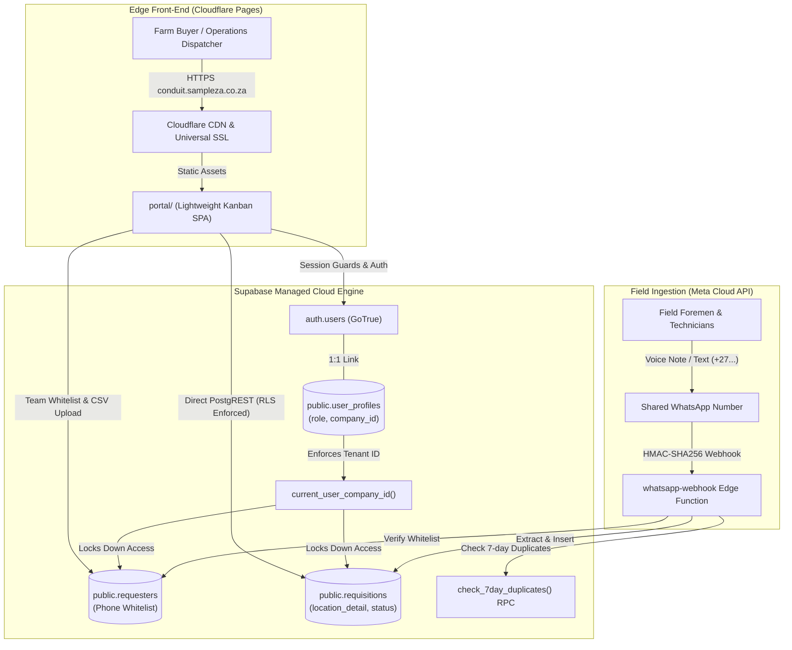
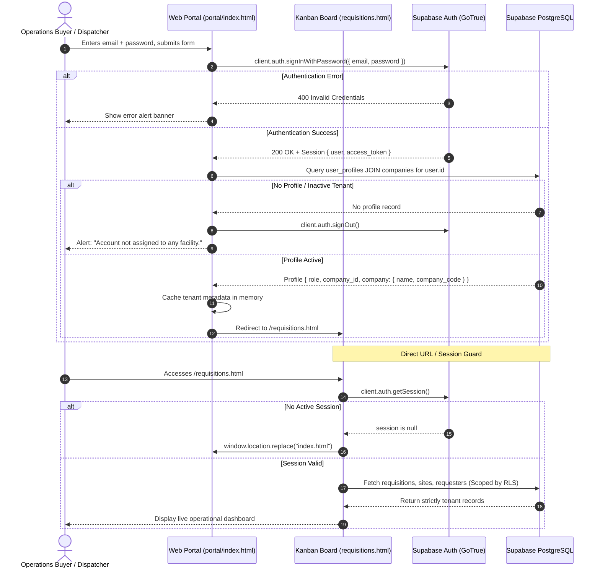
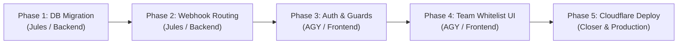

# ADR-0005: Multi-Tenant Tenant Isolation, Operational Team Whitelist & Cloudflare Pages Deployment

## Status
Accepted

## Target Implementers
- **Google Jules**: Database migrations (`supabase/migrations/`) & Webhook routing logic (`supabase/functions/whatsapp-webhook/`)
- **AGY**: Client authentication, session guards, and Team Management UI (`portal/`)

## Context
Supply Conduit is transitioning from a single-company prototype environment to a production-grade multi-tenant enterprise system. In the initial prototype:
1. Row-Level Security (RLS) policies contained a fallback `(current_user_company_id() IS NULL OR ...)` that allowed unauthenticated access or leaked cross-tenant records if user claims were absent.
2. The WhatsApp webhook auto-provisioned unknown numbers into a default company (`DEFAULT_COMPANY_ID`). In a shared multi-tenant WhatsApp bot number deployment, unknown numbers must not be auto-bound to an arbitrary tenant.
3. Operations buyers on commercial farms, cold-storage packhouses, and industrial sites had no dashboard interface to register and whitelist their field foremen and mobile numbers.
4. The static frontend in `portal/` was designed for static edge hosting but lacked a formalized Cloudflare Pages configuration, custom subdomain routing (`conduit.sampleza.co.za`), and security header hardening.

---

## 1. Master System Architecture Overview



---

## 2. Relational Schema Specification

### 2.1 DDL & Constraints
The database schema introduces tenant user profiles, company self-onboarding codes, and strict phone number constraints.

```sql
-- 1. Extend public.companies with 6-character onboarding code
ALTER TABLE public.companies 
ADD COLUMN IF NOT EXISTS company_code VARCHAR(6) UNIQUE;

CREATE UNIQUE INDEX IF NOT EXISTS idx_companies_company_code_upper 
ON public.companies (UPPER(company_code));

COMMENT ON COLUMN public.companies.company_code IS 
'Unique 6-character uppercase alphanumeric code used by field requesters for zero-touch farm onboarding.';

-- Ensure existing default company has a valid code
UPDATE public.companies 
SET company_code = 'APEX01' 
WHERE id = '00000000-0000-0000-0000-000000000001' AND company_code IS NULL;

ALTER TABLE public.companies 
ALTER COLUMN company_code SET NOT NULL;

-- 2. Create User Role Enum
DO $$ BEGIN
    CREATE TYPE public.user_role AS ENUM ('admin', 'buyer', 'dispatcher', 'viewer');
EXCEPTION
    WHEN duplicate_object THEN null;
END $$;

-- 3. Create public.user_profiles (Tenant Membership)
CREATE TABLE IF NOT EXISTS public.user_profiles (
    id UUID PRIMARY KEY DEFAULT gen_random_uuid(),
    user_id UUID NOT NULL REFERENCES auth.users(id) ON DELETE CASCADE,
    company_id UUID NOT NULL REFERENCES public.companies(id) ON DELETE CASCADE,
    full_name TEXT NOT NULL,
    role public.user_role DEFAULT 'buyer'::public.user_role NOT NULL,
    phone_number VARCHAR(20),
    is_active BOOLEAN DEFAULT true NOT NULL,
    created_at TIMESTAMPTZ DEFAULT timezone('utc'::text, now()) NOT NULL,
    updated_at TIMESTAMPTZ DEFAULT timezone('utc'::text, now()) NOT NULL,
    CONSTRAINT uq_user_profiles_user UNIQUE (user_id)
);

CREATE INDEX IF NOT EXISTS idx_user_profiles_user_company 
ON public.user_profiles(user_id, company_id);

CREATE INDEX IF NOT EXISTS idx_user_profiles_company_id 
ON public.user_profiles(company_id);

CREATE TRIGGER trg_user_profiles_updated_at 
BEFORE UPDATE ON public.user_profiles 
FOR EACH ROW EXECUTE FUNCTION public.update_updated_at_column();

-- 4. Tighten constraints on public.requesters
-- Phone number must be unique among active requesters across the single WhatsApp conduit
CREATE UNIQUE INDEX IF NOT EXISTS uq_requesters_active_phone 
ON public.requesters (phone_number) 
WHERE (is_active = true);
```

### 2.2 Session Context Function (`current_user_company_id()`)
Queries `public.user_profiles` directly using `auth.uid()`, eliminating stale JWT claim dependency:

```sql
CREATE OR REPLACE FUNCTION public.current_user_company_id() 
RETURNS uuid 
LANGUAGE plpgsql 
STABLE 
SECURITY DEFINER 
SET search_path = public
AS $$
DECLARE
    v_company_id uuid;
BEGIN
    -- 1. Primary: Resolve company from user_profiles table using authenticated UID
    SELECT company_id INTO v_company_id
    FROM public.user_profiles
    WHERE user_id = auth.uid() AND is_active = true
    LIMIT 1;

    IF v_company_id IS NOT NULL THEN
        RETURN v_company_id;
    END IF;

    -- 2. Secondary: Fallback to JWT app_metadata claim if set
    RETURN NULLIF(current_setting('request.jwt.claims', true)::jsonb -> 'app_metadata' ->> 'company_id', '')::uuid;
EXCEPTION
    WHEN OTHERS THEN
        RETURN NULL;
END;
$$;
```

### 2.3 Hardened PostgreSQL Row-Level Security (RLS) Policies

All permissive `(current_user_company_id() IS NULL OR ...)` clauses are purged. Access is fail-closed.

```sql
-- 1. Drop existing prototype policies
DROP POLICY IF EXISTS "Allow read access to companies" ON public.companies;
DROP POLICY IF EXISTS "Allow modifications to companies" ON public.companies;
DROP POLICY IF EXISTS "Allow read access to sites" ON public.sites;
DROP POLICY IF EXISTS "Allow modifications to sites" ON public.sites;
DROP POLICY IF EXISTS "Allow read access to zones" ON public.zones;
DROP POLICY IF EXISTS "Allow modifications to zones" ON public.zones;
DROP POLICY IF EXISTS "Allow read access to requesters" ON public.requesters;
DROP POLICY IF EXISTS "Allow modifications to requesters" ON public.requesters;
DROP POLICY IF EXISTS "Allow read access to requisitions" ON public.requisitions;
DROP POLICY IF EXISTS "Allow modifications to requisitions" ON public.requisitions;
DROP POLICY IF EXISTS "Allow read access to requisition_items" ON public.requisition_items;
DROP POLICY IF EXISTS "Allow modifications to requisition_items" ON public.requisition_items;

-- 2. User Profiles
ALTER TABLE public.user_profiles ENABLE ROW LEVEL SECURITY;

CREATE POLICY "user_profiles_select" ON public.user_profiles
FOR SELECT TO authenticated
USING (user_id = auth.uid() OR company_id = public.current_user_company_id());

CREATE POLICY "user_profiles_update" ON public.user_profiles
FOR UPDATE TO authenticated
USING (
    user_id = auth.uid() 
    OR (
        company_id = public.current_user_company_id() 
        AND EXISTS (
            SELECT 1 FROM public.user_profiles 
            WHERE user_id = auth.uid() AND role = 'admin'
        )
    )
)
WITH CHECK (company_id = public.current_user_company_id());

-- 3. Companies
CREATE POLICY "companies_tenant_select" ON public.companies
FOR SELECT TO authenticated
USING (id = public.current_user_company_id());

CREATE POLICY "companies_tenant_update" ON public.companies
FOR UPDATE TO authenticated
USING (id = public.current_user_company_id())
WITH CHECK (id = public.current_user_company_id());

-- 4. Sites
CREATE POLICY "sites_tenant_select" ON public.sites
FOR SELECT TO authenticated
USING (company_id = public.current_user_company_id());

CREATE POLICY "sites_tenant_modify" ON public.sites
FOR ALL TO authenticated
USING (company_id = public.current_user_company_id())
WITH CHECK (company_id = public.current_user_company_id());

-- 5. Zones
CREATE POLICY "zones_tenant_select" ON public.zones
FOR SELECT TO authenticated
USING (site_id IN (
    SELECT id FROM public.sites WHERE company_id = public.current_user_company_id()
));

CREATE POLICY "zones_tenant_modify" ON public.zones
FOR ALL TO authenticated
USING (site_id IN (
    SELECT id FROM public.sites WHERE company_id = public.current_user_company_id()
))
WITH CHECK (site_id IN (
    SELECT id FROM public.sites WHERE company_id = public.current_user_company_id()
));

-- 6. Requesters (Operational Whitelist)
CREATE POLICY "requesters_tenant_select" ON public.requesters
FOR SELECT TO authenticated
USING (company_id = public.current_user_company_id());

CREATE POLICY "requesters_tenant_modify" ON public.requesters
FOR ALL TO authenticated
USING (company_id = public.current_user_company_id())
WITH CHECK (company_id = public.current_user_company_id());

-- 7. Requisitions
CREATE POLICY "requisitions_tenant_select" ON public.requisitions
FOR SELECT TO authenticated
USING (company_id = public.current_user_company_id());

CREATE POLICY "requisitions_tenant_modify" ON public.requisitions
FOR ALL TO authenticated
USING (company_id = public.current_user_company_id())
WITH CHECK (company_id = public.current_user_company_id());

-- 8. Requisition Items
CREATE POLICY "requisition_items_tenant_select" ON public.requisition_items
FOR SELECT TO authenticated
USING (requisition_id IN (
    SELECT id FROM public.requisitions WHERE company_id = public.current_user_company_id()
));

CREATE POLICY "requisition_items_tenant_modify" ON public.requisition_items
FOR ALL TO authenticated
USING (requisition_id IN (
    SELECT id FROM public.requisitions WHERE company_id = public.current_user_company_id()
))
WITH CHECK (requisition_id IN (
    SELECT id FROM public.requisitions WHERE company_id = public.current_user_company_id()
));
```

---

## 3. Authentication & Session State Flow

### 3.1 Flow Diagram



### 3.2 Client Session Guard Invariants
1. **Bypass Removal**: The prototype button `#demoBypassBtn` is decommissioned in production.
2. **Immediate Page Guard**: Executed before rendering DOM elements on `portal/requisitions.html`.
3. **Reactive Invalidation**: `supabase.auth.onAuthStateChange` immediately redirects to `index.html` on `SIGNED_OUT` or token expiry.
4. **Tenant Scoping**: All PostgREST queries in `portal/assets/js/kanban.js` rely on RLS rather than hardcoded `AppConfig.COMPANY_ID` constants.

---

## 4. Operational Requester Team Management & Whitelist UI

### 4.1 Interface Layout & Navigation
Farm buyers manage their authorized WhatsApp senders through a **"Field Team"** modal launched directly from the top navigation in `portal/requisitions.html`:

- **Top Bar Badge**: `[TEAM (Count)]` pill indicating total whitelisted workers.
- **Main View**:
  - Filter by Name, Phone, or Designation.
  - Filter by Default Assigned Site.
  - Active / Deactivated status pills.
  - One-click status toggle (Reactivate / Deactivate).
  - Add Requester button.
  - Batch CSV Upload button.
  - Download CSV Template button.

### 4.2 Add / Edit Requester Modal
- **Full Name**: E.g., `Sipho Khumalo`.
- **Mobile Phone Number**: Auto-normalized to E.164.
  - `0821234567` $\rightarrow$ `+27821234567`
  - `27821234567` $\rightarrow$ `+27821234567`
  - `+27 82 123 4567` $\rightarrow$ `+27821234567`
- **Role / Designation**: E.g., `Packhouse Supervisor`, `Workshop Foreman`, `Irrigation Specialist`.
- **Default Assigned Site**: Dropdown loaded dynamically from `public.sites`.
- **Is Active**: Boolean toggle.

### 4.3 CSV Batch Importer Specification
- **CSV Headers**: `full_name,phone_number,role_title,site_code`
- **Validation Engine**:
  - Sanitizes formulas starting with `=`, `+`, `-`, `@` (Excel formula injection prevention).
  - Validates phone format against E.164 regex.
  - Verifies `site_code` against tenant's existing active sites.
- **Preview Table**: Displays row-by-row syntax feedback with error chips prior to database execution.
- **Upsert Operation**: Batch inserts into `public.requesters` with tenant `company_id`.

---

## 5. Shared Multi-Tenant WhatsApp Bot Ingestion Invariants

### 5.1 Inbound Webhook Execution Rules
When a WhatsApp payload hits `supabase/functions/whatsapp-webhook`:

1. **Phone Extraction**: Normalizes `entry[...].from` into E.164 (`+27...`).
2. **Whitelist Lookup**: Queries `public.requesters` where `phone_number = normalizedPhone`.
3. **Execution Decision Matrix**:
   - **Case 1: Requester Registered & Active**:
     - Route requisition to `requester.company_id` and `requester.default_site_id`.
     - Invoke Gemini 3.8 Flash structured extraction and check 7-day duplicates.
     - Persist requisition and dispatch confirmation card.
   - **Case 2: Requester Inactive (`is_active = false`)**:
     - Do not create requisition.
     - Dispatch outbound WhatsApp alert:
       `"⚠️ Notice: Your field account for [Company Name] is currently inactive. Please contact your operations manager to re-activate your requisitions access."`
   - **Case 3: Unknown Number (Not Whitelisted)**:
     - Check if inbound message is a 6-character Company Code (`^[A-Z0-9]{6}$`):
       - If code matches `public.companies.company_code`: Auto-enroll requester into that tenant using their WhatsApp contact name and company primary site. Reply with welcome receipt:
         `"🎉 Welcome to Supply Conduit! Your number has been linked to *[Company Name]*. You can now send voice notes or text messages here anytime to log field requisitions."`
       - If not a valid code or regular requisition attempt: Return fallback receipt without saving a ticket or invoking Gemini:
         `"👋 Welcome to Supply Conduit. Your number is not yet linked to an active farm or facility. Please contact your operations manager or enter your 6-character Company Code."`

---

## 6. Cloudflare Pages Deployment Specification

### 6.1 Build & Deployment Settings

| Property | Value | Rationale |
| :--- | :--- | :--- |
| **Project Name** | `supply-conduit-portal` | Distinguishable in Cloudflare dashboard |
| **Production Branch** | `main` | Automatic deployment on push |
| **Framework Preset** | `None` | Static client without compilation requirement |
| **Build Command** | *(Empty)* | Zero-build deployment |
| **Build Output Directory** | `portal` | Cloudflare directly serves files from `portal/` |
| **Root Directory** | `/` | Git repository root |

### 6.2 Custom Subdomain & DNS Configuration (`conduit.sampleza.co.za`)
1. In Cloudflare Dashboard $\rightarrow$ **Workers & Pages** $\rightarrow$ `supply-conduit-portal` $\rightarrow$ **Custom domains**.
2. Target Domain: `conduit.sampleza.co.za` (Zone: `sampleza.co.za`).
3. DNS Record:
   - **Type**: `CNAME`
   - **Name**: `conduit`
   - **Content**: `supply-conduit-portal.pages.dev`
   - **Proxy Status**: `Proxied` (Orange Cloud enabled)
4. SSL/TLS Setting: **Full (Strict)**.

### 6.3 Security Headers Configuration (`portal/_headers`)
```http
/*
  X-Frame-Options: DENY
  X-Content-Type-Options: nosniff
  Referrer-Policy: strict-origin-when-cross-origin
  Permissions-Policy: microphone=(), camera=(), geolocation=()
  Content-Security-Policy: default-src 'self'; script-src 'self' 'unsafe-inline' https://cdn.tailwindcss.com https://unpkg.com https://cdn.jsdelivr.net; style-src 'self' 'unsafe-inline' https://fonts.googleapis.com; font-src 'self' https://fonts.gstatic.com; connect-src 'self' https://wtaewaeqmcqrwradlncj.supabase.co wss://wtaewaeqmcqrwradlncj.supabase.co; img-src 'self' data: https:; media-src 'self' https: blob:;
```

### 6.4 Environment Resolution (`portal/assets/js/config.js`)
Host-based switching determines whether the client runs in local development or production:
- `localhost` / `127.0.0.1`: Allows optional local overrides via `localStorage`.
- `conduit.sampleza.co.za` / `*.pages.dev`: Locks to production Supabase URL and public `anon` key.
- Under no circumstances is `SUPABASE_SERVICE_ROLE_KEY` exposed in client assets.

---

## 7. Phased Implementation Roadmap



1. **Phase 1: Database Migrations & RLS Hardening (`supabase/migrations/`)**:
   - Apply `20261006000001_tenant_isolation_and_profiles.sql`.
   - Update `current_user_company_id()` and replace permissive RLS policies.
   - Synchronize active schema documentation via `./scripts/sync_schema.sh`.
2. **Phase 2: WhatsApp Webhook Multi-Tenant Invariants (`supabase/functions/`)**:
   - Update `whatsapp-webhook/index.ts` to enforce whitelist and company code auto-onboarding.
   - Run automated test suite `index_test.ts` and deploy via `./scripts/deploy-functions.sh`.
3. **Phase 3: Client Authentication & Session Guards (`portal/`)**:
   - Clean up `portal/index.html` (retire demo bypass).
   - Implement `enforceSessionGuard()` and dynamic profile resolution in `portal/assets/js/kanban.js`.
4. **Phase 4: Team Whitelist Management & CSV Tool (`portal/`)**:
   - Implement Team Management modal, Add/Edit Requester dialog, and CSV batch tool.
   - Test bulk foremen onboarding against remote Supabase instance.
5. **Phase 5: Cloudflare Pages Deployment & Production Verification**:
   - Commit `portal/_headers` and connect repository to Cloudflare Pages.
   - Verify DNS CNAME for `conduit.sampleza.co.za` and run end-to-end multi-tenant validation.
