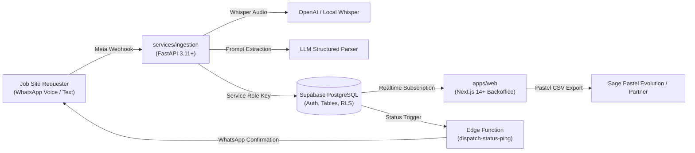

# System Architecture & Component Map

## 1. High-Level Architecture

Supply Conduit is engineered under Simple Solutions' *"Build Once, Resell 10x"* architecture. It connects low-bandwidth, noise-heavy industrial job sites directly to the backoffice procurement team with zero friction.

---

## 2. Directory Boundaries & Responsibilities

| Directory | Role | Runtime / Framework | Boundary Rules |
| :--- | :--- | :--- | :--- |
| `services/ingestion` | Inbound webhook & AI extraction engine | Python 3.11+ / FastAPI | Accesses DB via Service Role. Does not serve frontend views. |
| `apps/web` | Backoffice procurement management portal | Next.js 14+ (App Router), Tailwind | Uses `@supabase/ssr` with RLS. Handles Kanban board & Pastel export. |
| `packages/supabase` | PostgreSQL schema, RLS, Edge Functions | PostgreSQL 15, Deno Edge | Database single source of truth. Enforces tenant isolation. |
| `packages/shared` | Monorepo cross-boundary definitions | TypeScript / NodeNext | Holds canonical status enums, urgency definitions, and DB types. |
| `tools` | Operational utilities & offline scripts | Python 3 CLI | Seed scripts and Sage Pastel CSV format checkers. Strictly named `tools`. |

---

## 3. Workflow Pipelines

### Pipeline A: Inbound WhatsApp Requisition
1. **Webhook Ingestion**: Site foreman sends a WhatsApp audio voice note or text message.
2. **Signature Verification**: `services/ingestion/app/core/security.py` checks `X-Hub-Signature-256`.
3. **Audio Transcription**: Voice notes are downloaded from Meta Cloud API and sent to Whisper.
4. **Structured Parsing**: `RequisitionExtractorService` extracts items, quantities, and urgency into `RequisitionExtractionResult`.
5. **7-Day Duplicate Check**: Ingestion service calls PostgreSQL RPC `check_7day_duplicates` to identify duplicate requisitions from the same site.
6. **Database Persistence**: Requisition and items are inserted into Supabase.
7. **WhatsApp Ack**: Ingestion service sends confirmation ping back to site agent.

### Pipeline B: Office Triage & Sage Pastel Export
1. **Live Board**: Office procurement clerks view the Kanban pipeline (`apps/web`). Supabase Realtime updates cards automatically.
2. **Review & Status Progression**: Buyer moves requisition from `LOGGED` -> `PENDING_QUOTE` -> `PO_PLACED`.
3. **Status Ping**: Supabase trigger invokes `dispatch-status-ping` Edge Function, sending an automated WhatsApp update to the requester.
4. **Pastel CSV Export**: On demand, backoffice downloads a Pastel-formatted CSV ready for batch import into Sage Pastel Partner/Evolution.
